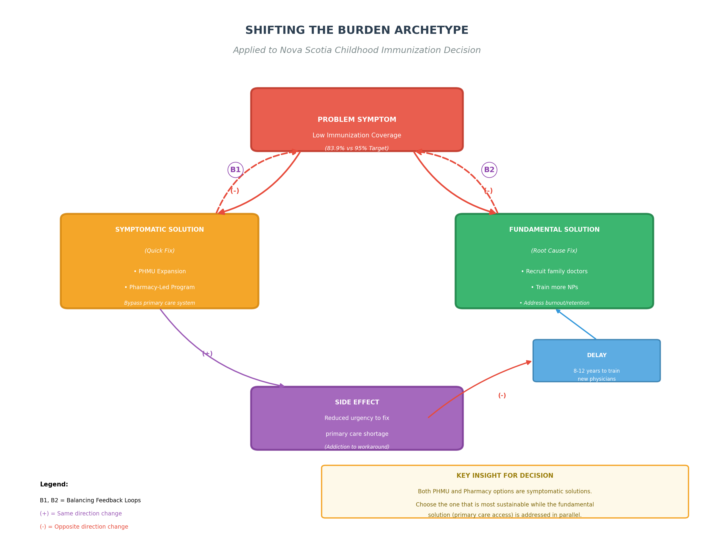
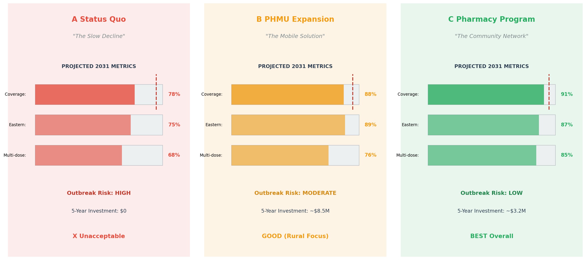

## Nova Scotia Childhood Immunization Decision Support

## Table of Contents

1. [System Archetype Identification](#1-system-archetype-identification)
2. [Scenario Narratives](#2-scenario-narratives)
3. [Leverage Point Analysis](#3-leverage-point-analysis)
4. [Implications for Decision](#4-implications-for-decision)
5. [References](#5-references)

---

## 1. System Archetype Identification

### 1.1 Primary Archetype: "Shifting the Burden"

The Nova Scotia childhood immunization system exhibits a classic **"Shifting the Burden"** archetype, where symptomatic solutions (alternative vaccination delivery models) are being considered instead of addressing the fundamental problem (primary care provider shortage).

#### Generic Archetype Structure

The "Shifting the Burden" archetype occurs when a problem symptom is addressed by applying a symptomatic (quick-fix) solution that diverts attention from more fundamental solutions. Over time, the fundamental solution becomes weaker as dependency on the symptomatic solution grows (Senge, 2006).



#### Mapping to Nova Scotia Immunization Context

| Archetype Element | Generic Definition | Nova Scotia Context |
|-------------------|-------------------|---------------------|
| **Problem Symptom** | The visible issue requiring attention | Low childhood immunization coverage rates (83.9% vs 95% target) |
| **Symptomatic Solution** | Quick fix that addresses symptoms | PHMUs and Pharmacy-Led Programs bypass the primary care system |
| **Fundamental Solution** | Root cause intervention | Fixing the primary care shortage (66,768 on waiting list) |
| **Side Effect** | Unintended consequence of symptomatic fix | Reduced political/economic pressure to address physician shortage |
| **Delay** | Time lag before fundamental solution shows effect | Training/recruiting physicians takes 8-12 years |

#### Causal Loop Representation

```
                    ┌─────────────────────────────────────────────────────────┐
                    │                                                         │
                    │    SHIFTING THE BURDEN: NS Immunization System          │
                    │                                                         │
                    └─────────────────────────────────────────────────────────┘

                              PROBLEM SYMPTOM
                    ┌─────────────────────────────────┐
                    │   Low Immunization Coverage     │
                    │        (83.9% < 95%)            │
                    └───────────────┬─────────────────┘
                                    │
                 ┌──────────────────┼──────────────────┐
                 │                  │                  │
                 ▼                  │                  ▼
    ┌────────────────────┐         │      ┌────────────────────────┐
    │  SYMPTOMATIC       │         │      │   FUNDAMENTAL          │
    │  SOLUTION          │   B1    │  B2  │   SOLUTION             │
    │                    │◄────────┤──────►                        │
    │  • PHMU Expansion  │    (-)  │  (-) │  • Recruit more        │
    │  • Pharmacy-Led    │         │      │    family doctors      │
    │    Programs        │         │      │  • Train more NPs      │
    │                    │         │      │  • Address burnout     │
    └─────────┬──────────┘         │      └────────────┬───────────┘
              │                    │                   │
              │                    │                   │
              │    SIDE EFFECT     │        DELAY      │
              │    ┌───────────────┴─────┐  (8-12     │
              └────►  Reduced urgency    │   years)   │
                   │  to fix primary     │◄───────────┘
                   │  care shortage      │
                   └─────────────────────┘
                              │
                              │ (+)
                              ▼
                   ┌─────────────────────┐
                   │  Addiction Effect:  │
                   │  System becomes     │
                   │  dependent on       │
                   │  alternative        │
                   │  delivery models    │
                   └─────────────────────┘
```

#### Evidence Supporting Archetype Identification

| Evidence | Data Source | Interpretation |
|----------|-------------|----------------|
| **E1: Persistent coverage gap** | Temporal analysis shows 10 years below 95% target | Symptomatic solutions (school-based programs) haven't solved the fundamental problem |
| **E2: Growing unattached population** | 66,768 on Family Practice Registry (Background.md) | Fundamental problem is worsening, not improving |
| **E3: Zone disparities persist** | Eastern Zone (83.3%) vs Northern Zone (88.3%) | Current system has inherent accessibility limitations |
| **E4: COVID-19 vulnerability** | 5.5% coverage drop in 2020 | System fragility when disrupted indicates structural weakness |

#### Why This Archetype Matters for the Decision

1. **Neither PHMU nor Pharmacy programs address the root cause**  both are symptomatic solutions that bypass rather than fix the primary care gap.

2. **The chosen intervention may create dependency**  if successful, it may reduce political will to address the physician shortage.

3. **Decision-makers should anticipate the "addiction" effect** plan for long-term sustainability rather than assuming these are temporary bridges.

4. **Both options are legitimate within this archetype**  the question becomes which symptomatic solution is more sustainable and scalable while the fundamental solution (primary care access) is addressed in parallel.

---

### 1.2 Secondary Archetype: "Fixes That Fail"

A related archetype also applies: **"Fixes That Fail"**, where a fix has unintended consequences that worsen the original problem over time.

#### Application to Nova Scotia Context

| Element | Application |
|---------|-------------|
| **Problem** | Low immunization coverage in unattached children |
| **Fix** | Expand PHMUs or Pharmacy programs |
| **Unintended Consequence (PHMU)** | Draws scarce nurses away from other public health functions, potentially worsening staff burnout |
| **Unintended Consequence (Pharmacy)** | If training/oversight is inadequate, could result in adverse events that damage public trust |

This archetype reminds decision-makers to **anticipate second-order effects** of their chosen intervention.

---

## 2. Scenario Narratives

The following three scenarios project the Nova Scotia immunization system over a **5-10 year horizon** based on different intervention choices. Each scenario is grounded in the data analysis and system dynamics identified in this project.



---

### 2.1 Scenario A: Status Quo

**"The Slow Decline"**

*A narrative of what happens if no new intervention is implemented*

#### Narrative (300 words)

By 2031, Nova Scotia's childhood immunization coverage has declined to approximately **78-80%**, well below the critical 95% threshold needed for herd immunity. The decade following 2026 saw the continuation of existing trends: a persistent primary care shortage, growing waitlists, and reliance on an increasingly strained school-based vaccination program.

The Eastern Zone, already the weakest performer in 2022 at 83.3%, has dropped to approximately 75% coverage. Rural communities in Guysborough, Antigonish, and Cape Breton face the most severe access challenges. Without a family doctor and with limited public health nursing capacity, many families simply cannot access routine childhood vaccines before school entry.

The multi-dose completion problem has worsened significantly. While first-dose uptake for vaccines like HPV remains around 85%, completion rates for second and third doses have fallen below 70%. Parents, frustrated by the difficulty of scheduling follow-up appointments through an overwhelmed system, simply give up.

In 2029, Nova Scotia experiences its first significant measles outbreak since the 1990s. Thirty-seven cases are confirmed in the Halifax Regional Municipality, with several hospitalizations. The outbreak strains an already overwhelmed healthcare system and generates significant media attention. Public health officials issue urgent appeals, but the damage to public trust is substantial.

The provincial government faces criticism for failing to act despite years of warnings from public health professionals. A hastily assembled task force recommends emergency measures, including mandatory vaccination policies that prove politically divisive.

The human cost is measured not just in illness, but in lost educational time, parental anxiety, and healthcare system burden. The economic cost estimated at $4.2 million for outbreak response alone far exceeds what proactive intervention would have required.

**Key Metrics (Projected 2031):**
- Provincial coverage: ~78%
- Eastern Zone coverage: ~75%
- Multi-dose completion rate: ~68%
- Outbreak risk: HIGH

---

### 2.2 Scenario B: PHMU Expansion

**"The Mobile Solution"**

*A narrative of expanding Public Health Mobile Units as the primary intervention*

#### Narrative (300 words)

By 2031, Nova Scotia Health has deployed a fleet of **12 Public Health Mobile Units**, up from 3 in 2026. These units rotate through the province's four health zones, with particular focus on the underserved Eastern and Western regions. The investment totals approximately $8.5 million over five years, including vehicle acquisition, staffing, and operational costs.

The impact on rural coverage is significant. The Eastern Zone, previously the weakest performer, has improved from 83.3% to approximately **89%** coverage. Mobile units have become a familiar and trusted presence in communities like Canso, Sherbrooke, and Baddeck, where families previously had to travel over an hour for vaccination services.

However, the program faces persistent challenges. The nursing shortage that affects all of Nova Scotia's healthcare system has not spared the PHMU program. Recruitment has been difficult, and several units have had to reduce their schedules due to staffing gaps. In 2029, two planned unit deployments to remote Cape Breton communities were cancelled when nurses resigned for hospital positions offering better pay and more stable schedules.

The urban-rural equity pattern has shifted. While rural coverage has improved substantially, urban areas—particularly lower-income neighborhoods in Halifax have seen limited benefit from the mobile units. These communities need accessible, walk-in services rather than scheduled mobile visits.

Multi-dose completion remains a challenge. The mobile units' rotating schedules make it difficult for families to return for follow-up doses. Coverage for first doses has improved more than for completion rates, suggesting the program is successful at initiating vaccination series but less effective at ensuring completion.

Provincial coverage has improved to approximately **88%**, a meaningful gain but still 7 percentage points short of the herd immunity target.

**Key Metrics (Projected 2031):**
- Provincial coverage: ~88%
- Eastern Zone coverage: ~89%
- Multi-dose completion rate: ~76%
- Outbreak risk: MODERATE

---

### 2.3 Scenario C: Pharmacy-Led Program

**"The Community Network"**

*A narrative of establishing a standardized Pharmacy-Led Pediatric Vaccine Program*

#### Narrative (300 words)

By 2031, Nova Scotia has become a national leader in pharmacy-based pediatric immunization. Following the passage of expanded scope legislation in 2027, over **280 of the province's 320+ pharmacies** are now certified to administer routine childhood vaccines, including TDAP, MEN-C-ACYW-135, HBV, and HPV series to children as young as 5 years old.

The transformation required significant investment in pharmacist training. The Pediatric Immunization Training Program (PITP), developed in partnership with Dalhousie University's College of Pharmacy, has certified over 650 pharmacists. The provincial government subsidized training costs approximately $1,200 per pharmacist as part of Bill 210's implementation.

The results have exceeded expectations. Provincial coverage has reached approximately **91%**, the highest level since 2015. The Central Zone, with the highest pharmacy density, has achieved 93% coverage. Even the historically underperforming Eastern Zone has improved to approximately 87%, though rural areas with fewer pharmacies continue to lag.

The program's greatest success has been multi-dose completion. Pharmacies' extended hours, walk-in availability, and integrated reminder systems have addressed the completion gap that plagued the traditional system. Multi-dose series completion rates have improved from 76% to approximately **85%**, a transformational change driven by convenience and accessibility.

Parent trust has grown as pharmacists become recognized as immunization providers. Surveys indicate that 78% of parents are "very comfortable" having their child vaccinated at a pharmacy, up from 45% in 2026.

Challenges remain. Rural pharmacies face the same staffing constraints as other healthcare settings. Three communities—Canso, St. Peter's, and Meat Cove—have no pharmacy within 45 minutes, creating persistent gaps that require supplementary PHMU coverage.

**Key Metrics (Projected 2031):**
- Provincial coverage: ~91%
- Eastern Zone coverage: ~87%
- Multi-dose completion rate: ~85%
- Outbreak risk: LOW-MODERATE

---

### 2.4 Scenario Comparison Matrix

| Metric | Status Quo | PHMU Expansion | Pharmacy Program |
|--------|------------|----------------|------------------|
| **Provincial Coverage (2031)** | ~78% | ~88% | ~91% |
| **Eastern Zone Coverage** | ~75% | ~89% | ~87% |
| **Multi-dose Completion** | ~68% | ~76% | ~85% |
| **Outbreak Risk** | HIGH | MODERATE | LOW-MODERATE |
| **5-Year Investment** | $0 | ~$8.5M | ~$3.2M |
| **Scalability** | N/A | Limited (staffing) | High (infrastructure exists) |
| **Sustainability** | N/A | Dependent on nursing workforce | Leverages existing workforce |
| **Rural Coverage** | Poor | Excellent | Moderate (pharmacy gaps) |
| **Urban Coverage** | Moderate | Moderate | Excellent |

---

## 3. Leverage Point Analysis

### 3.1 Identifying System Leverage Points

Based on the Causal Loop Diagram and systems analysis, the following leverage points have been identified where interventions can most effectively shift system behavior.

#### Meadows' Leverage Point Framework Application

Donella Meadows' (1999) framework identifies 12 places to intervene in a system, ranked from least to most effective. Applying this framework to the Nova Scotia immunization system:

| Leverage Point Level | Type | Application to NS Immunization |
|---------------------|------|--------------------------------|
| **12 (Weakest)** | Constants/Parameters | Adjusting vaccine schedules, eligibility ages |
| **11** | Buffer sizes | Increasing vaccine inventory, staffing levels |
| **10** | Stock-Flow Structure | Adding PHMUs, expanding pharmacy scope (physical capacity) |
| **9** | Delays | Reducing wait times for appointments |
| **8** | Balancing Feedback | Improving coverage monitoring and response |
| **7** | Reinforcing Feedback | **Leveraging R2 (Trust-Completion Cycle)** |
| **6** | Information Flows | Public dashboards, parent reminder systems |
| **5** | Rules | Pharmacist scope of practice expansion |
| **4** | Self-Organization | Community-led vaccination initiatives |
| **3** | Goals | Shifting from "school entry compliance" to "early childhood protection" |
| **2** | Paradigm | Reframing vaccination as community responsibility, not just healthcare function |
| **1 (Strongest)** | Transcending Paradigms | Fundamental healthcare system redesign |

### 3.2 Primary Leverage Point: Vaccine Accessibility

**Why this is the key leverage point:**

The variable "Vaccine Accessibility" sits at the center of the CLD, connecting:
- The primary care gap (input)
- Coverage rates (output)
- Geographic disparity (outcome)
- Both intervention options (PHMU and Pharmacy)

```
                         ┌─────────────────────┐
                         │   LEVERAGE POINT    │
                         │                     │
  Primary Care Gap ─────►│ VACCINE            │─────► Coverage Rates
                         │ ACCESSIBILITY       │
  Rural/Remote      ────►│                     │─────► Zone Disparity
  Barriers               │                     │
                         └──────────┬──────────┘
                                    │
                    ┌───────────────┼───────────────┐
                    │               │               │
                    ▼               │               ▼
           ┌────────────────┐      │      ┌────────────────┐
           │     PHMU       │      │      │   PHARMACY     │
           │   CAPACITY     │      │      │   PROGRAM      │
           └────────────────┘      │      └────────────────┘
                                   │
                                   ▼
                          ┌────────────────┐
                          │  Both options  │
                          │ target same    │
                          │ leverage point │
                          └────────────────┘
```

### 3.3 Intervention Analysis at the Leverage Point

#### PHMU Impact on Vaccine Accessibility

| Factor | Effect | Magnitude |
|--------|--------|-----------|
| **Geographic reach** | Extends access to remote/rural areas | HIGH for Eastern/Western Zones |
| **Scheduling flexibility** | Limited by rotation schedule | MODERATE |
| **Capacity constraints** | Limited by nursing shortage | HIGH (negative) |
| **Trust building** | Familiar public health branding | MODERATE |
| **Multi-dose follow-up** | Difficult due to rotating schedule | LOW |

**Net Assessment:** Strong impact on geographic accessibility, but limited by workforce constraints and scheduling rigidity.

#### Pharmacy Program Impact on Vaccine Accessibility

| Factor | Effect | Magnitude |
|--------|--------|-----------|
| **Geographic reach** | 320+ locations across province | HIGH for urban, MODERATE for rural |
| **Scheduling flexibility** | Walk-in, extended hours, weekends | HIGH |
| **Capacity constraints** | Leverages existing workforce | LOW (positive) |
| **Trust building** | Community presence, familiar setting | HIGH |
| **Multi-dose follow-up** | Convenient return visits, reminder systems | HIGH |

**Net Assessment:** Strong overall accessibility improvement, particularly for urban areas and multi-dose completion, but rural pharmacy gaps remain a concern.

### 3.4 Resistance to Change Analysis

Any leverage point intervention will encounter resistance. Understanding these sources of resistance helps anticipate implementation challenges.

#### Sources of Resistance

| Resistance Source | PHMU | Pharmacy Program |
|-------------------|------|------------------|
| **Workforce** | Nurse recruitment competition with hospitals | Pharmacist scope concerns from medical associations |
| **Professional** | None significant | Potential physician association pushback |
| **Regulatory** | Existing framework sufficient | Requires Bill 210 implementation, PITP development |
| **Public** | Low (trusted model) | Moderate initially (parents unfamiliar with pharmacy vaccination for children) |
| **Financial** | High capital costs | Moderate training investment |
| **Political** | Moderate (budget allocation) | Low-Moderate (scope expansion already legislated) |

### 3.5 Leverage Point Recommendations

Based on this analysis, **the most effective intervention strategy combines both options** with differentiated deployment:

1. **Pharmacy Program as Primary Strategy:** Addresses the highest-volume opportunities (urban areas, multi-dose completion) with lower cost and higher sustainability.

2. **PHMU as Targeted Supplement:** Fills geographic gaps where pharmacies cannot reach, focusing on rural Eastern and Western zones.

3. **Information Flow Enhancement:** Both interventions should include robust reminder systems and coverage tracking to leverage the Trust-Completion feedback loop (R2).

---

## 4. Implications for Decision

### 4.1 Summary of Findings

This systems analysis has revealed several critical insights for the Director of Public Health's decision:

#### Key Finding 1: Both Options Are Symptomatic Solutions

Neither PHMUs nor Pharmacy programs address the fundamental problem of Nova Scotia's primary care shortage. Both represent "Shifting the Burden" strategies that work around rather than through the traditional healthcare system. This is not necessarily problematic symptomatic solutions are appropriate when the fundamental solution has long delays (8-12 years to train physicians) but decision-makers should recognize this dynamic and plan accordingly.

#### Key Finding 2: Pharmacy Program Offers Superior Scalability

The scenario analysis projects that a Pharmacy-Led Program achieves higher provincial coverage (91% vs 88%) at lower cost ($3.2M vs $8.5M over 5 years). This advantage stems from leveraging existing infrastructure and workforce rather than competing for scarce nursing staff.

#### Key Finding 3: PHMUs Excel in Rural/Remote Access

Despite lower overall metrics, PHMUs demonstrate superior performance in the Eastern Zone (89% vs 87%), addressing the province's most persistent geographic disparity. For communities without pharmacy access, mobile units remain the only viable solution.

#### Key Finding 4: Multi-Dose Completion is the Differentiator

The most significant difference between interventions is multi-dose completion rates (76% PHMU vs 85% Pharmacy). The pharmacy model's convenience—walk-in availability, extended hours, integrated reminders—directly addresses the completion gap that undermines vaccine effectiveness.

#### Key Finding 5: System Dynamics Favor Pharmacy Program

The R2 (Trust-Completion Cycle) feedback loop can be leveraged more effectively by pharmacy programs due to their community presence, accessibility, and ability to build ongoing relationships with families. This virtuous cycle can accelerate coverage improvement beyond the direct effect of increased access.

### 4.2 Recommendation Framework

Based on this analysis, the following decision framework is recommended:

#### Primary Recommendation: Pharmacy-Led Program

**Rationale:**
- Higher projected coverage (91% vs 88%)
- Lower cost and higher sustainability
- Better multi-dose completion
- Leverages R2 feedback loop effectively
- Existing legislative framework (Bill 210)

**Implementation Priority:**
1. Accelerate PITP certification training
2. Prioritize Central and Northern zones first (highest pharmacy density)
3. Develop parent awareness campaign emphasizing convenience and safety

#### Secondary Recommendation: PHMU as Targeted Supplement

**Rationale:**
- Essential for rural communities without pharmacy access
- Maintains coverage in Eastern Zone gap areas
- Complements pharmacy program's urban strength

**Implementation Priority:**
1. Focus mobile units on Eastern Zone (Guysborough, Antigonish, Cape Breton)
2. Coordinate schedules with pharmacy coverage maps to avoid duplication
3. Prioritize first-dose initiation, with pharmacy follow-up for completion

### 4.3 Uncertainties and Risks

| Uncertainty | Risk Level | Mitigation Strategy |
|-------------|------------|---------------------|
| Parent acceptance of pharmacy vaccination | MODERATE | Pilot program with satisfaction surveys; public awareness campaign |
| Pharmacist workforce availability in rural areas | HIGH | Training incentives for rural pharmacists; temporary PHMU coverage |
| Adverse event management | LOW-MODERATE | Clear protocols; pharmacist training; reporting system |
| Political sustainability of funding | MODERATE | Demonstrate ROI through coverage metrics; link to outbreak prevention |
| Dependency effect (Shifting the Burden) | MODERATE | Parallel investment in primary care recruitment; sunset/transition planning |

### 4.4 Preview of Final Recommendation

The complete recommendation will be developed in the final milestone, but this analysis supports a **hybrid approach** with pharmacy programs as the primary strategy and PHMUs as a targeted supplement for geographic gaps. This approach:

1. **Maximizes coverage improvement** through pharmacy accessibility
2. **Addresses equity concerns** through targeted PHMU deployment
3. **Manages costs** by leveraging existing infrastructure
4. **Builds sustainability** by not competing for scarce nursing staff
5. **Acknowledges system dynamics** by leveraging the Trust-Completion feedback loop

The final recommendation will include implementation timelines, budget allocations, success metrics, and contingency plans.

---

## 5. References

### Academic Sources

- Meadows, D. H. (1999). *Leverage Points: Places to Intervene in a System*. The Sustainability Institute.
- Senge, P. M. (2006). *The Fifth Discipline: The Art and Practice of the Learning Organization* (Revised ed.). Doubleday.
- Sterman, J. D. (2000). *Business Dynamics: Systems Thinking and Modeling for a Complex World*. McGraw-Hill.

### Public Health Sources

- Public Health Agency of Canada. (2024). *Canadian Immunization Guide*. Government of Canada.
- World Health Organization. (2020). *Immunization coverage: Key concepts*. WHO.
- Centers for Disease Control and Prevention. (2023). *Epidemiology and Prevention of Vaccine-Preventable Diseases* (14th ed.).

### Nova Scotia Specific Sources

- Nova Scotia Department of Health and Wellness. (2026). *School-Based Immunization Coverage Data*. Nova Scotia Open Data Portal.
- Nova Scotia Health Authority. (2025). *Primary Care Provider Registry Statistics*.
- Government of Nova Scotia. (2024). *Bill 210: Pharmacy Act Amendments*.

### Data Sources

- Nova Scotia Open Data Portal: [data.novascotia.ca](https://data.novascotia.ca/)
- Project Data Analysis: See `Clipped_Data/` folder and `EDA/ANALYSIS_REPORT.md`

## References

- Nova Scotia Open Data Portal: [data.novascotia.ca](https://data.novascotia.ca/)
- Nova Scotia Health Authority Zone Boundaries
- Canadian Immunization Guide (Public Health Agency of Canada)
- World Health Organization Herd Immunity Guidelines
