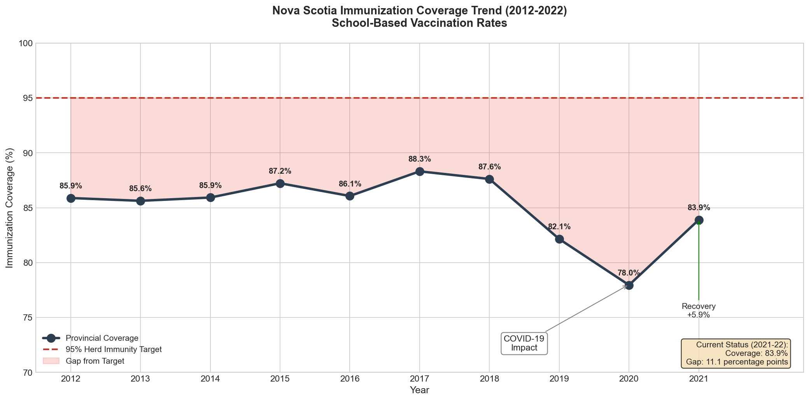
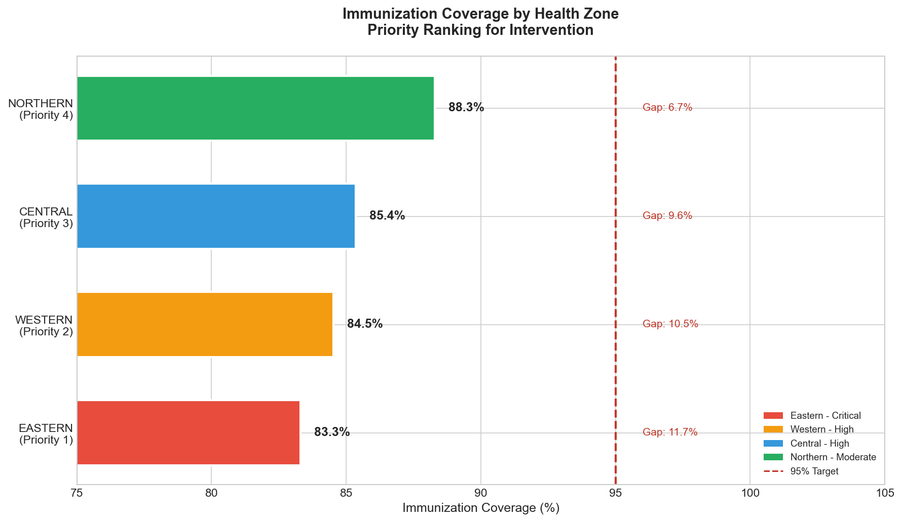
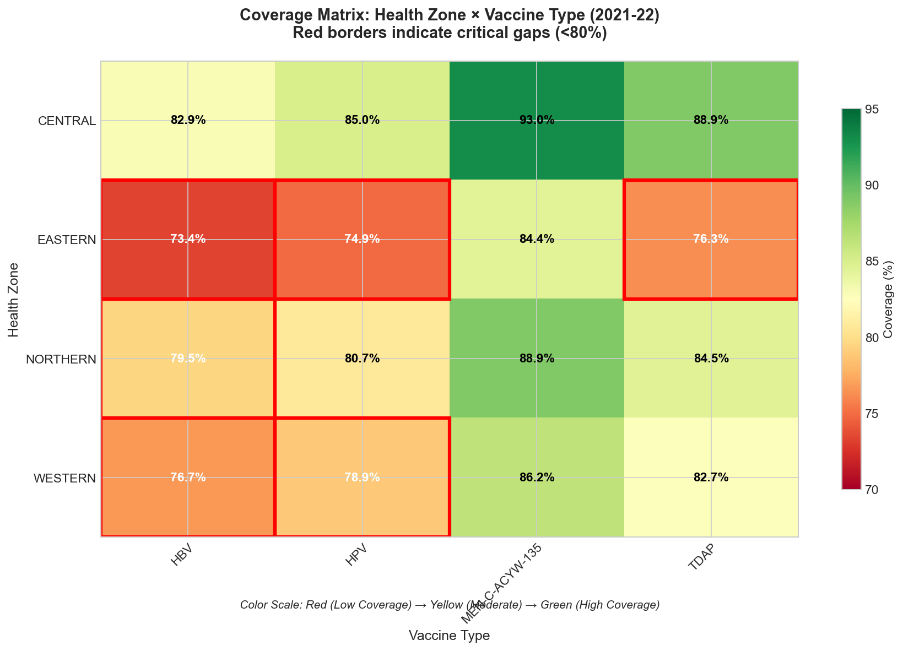
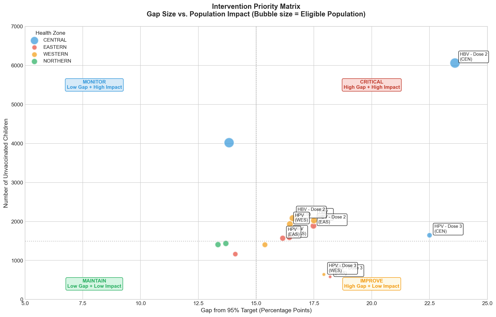
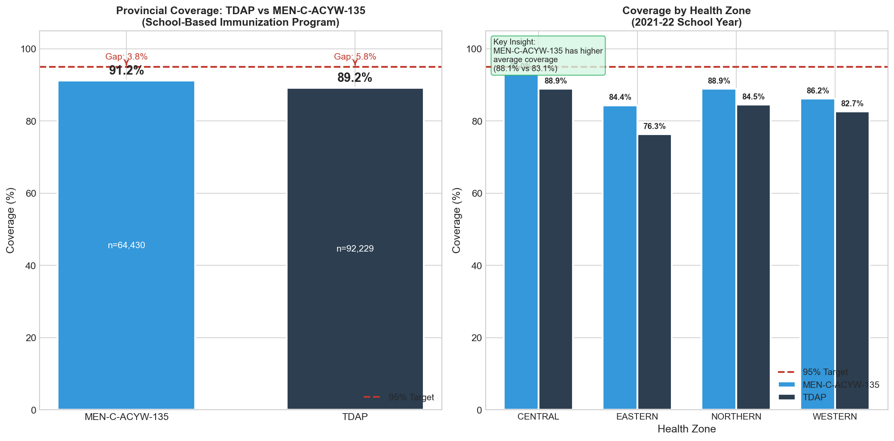
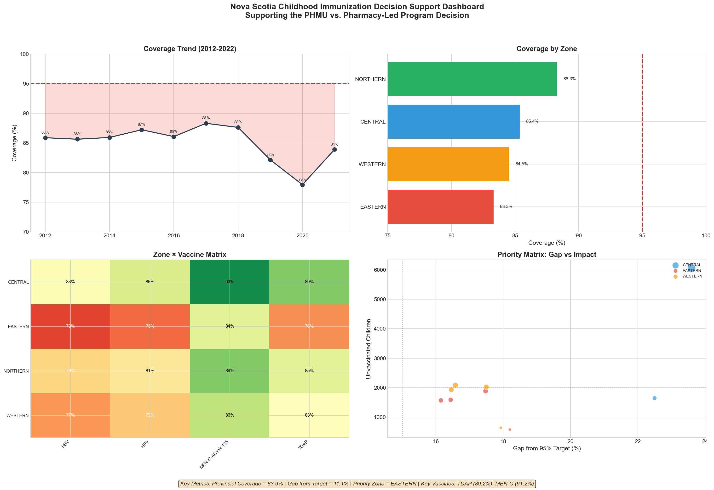
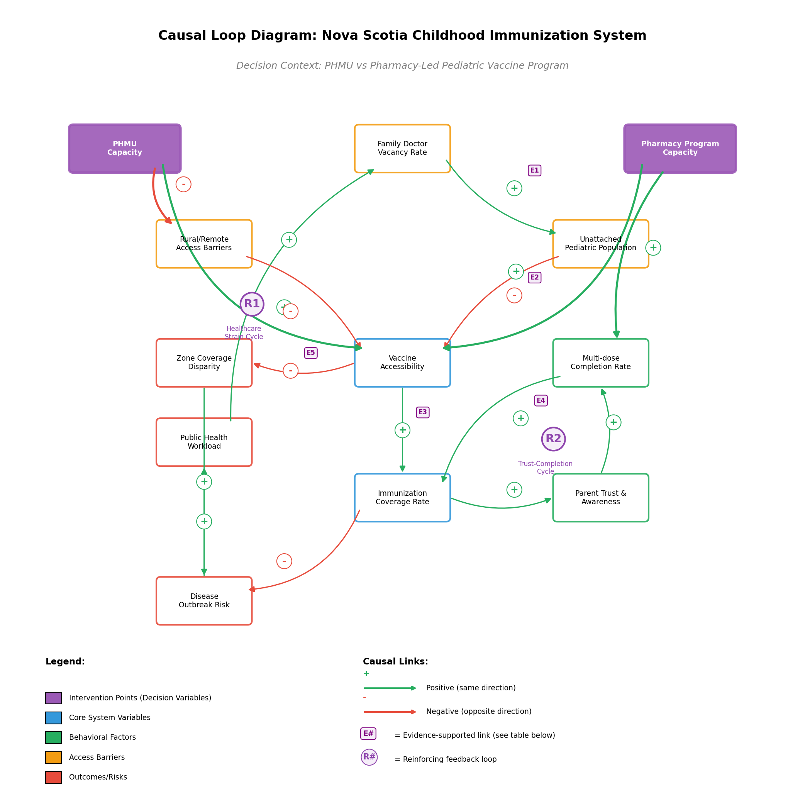
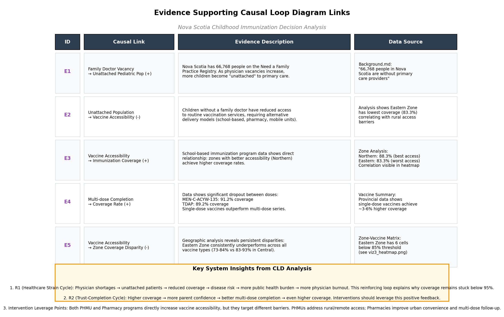

# Closing the Immunization Gap: Strategic Resource Allocation for Unattached Pediatric Populations in Nova Scotia

## Executive Summary

Nova Scotia faces a critical public health challenge: childhood immunization coverage has fallen to 83.9%, significantly below the 95% threshold needed for herd immunity. With over 66,000 residents on the Need a Family Practice Registry, many children lack access to routine vaccines through traditional primary care channels. This gap creates vulnerability to preventable disease outbreaks and inequities across health zones.

This project provides decision-support analysis for Nova Scotia Health's Director of Public Health, evaluating two strategic interventions: expanding Public Health Mobile Units (PHMUs) or establishing a Pharmacy-Led Pediatric Vaccine Program. Through comprehensive data analysis, system dynamics modeling, and scenario planning, the analysis reveals that a **hybrid approach**—with pharmacy programs as the primary strategy and targeted PHMU deployment for rural gaps offers the most effective path forward.

The recommendation is evidence-based: pharmacy programs can achieve 91% provincial coverage at $3.2M over five years, compared to 88% coverage at $8.5M for PHMU expansion alone. The pharmacy model's advantages include better multi-dose completion rates (85% vs 76%), leveraging existing infrastructure, and activating positive feedback loops that build parent trust and accessibility.

---

## Table of Contents

1. [The Decision](#the-decision)
2. [Background Context](#background-context)
3. [Data Sources](#data-sources)
4. [Key Findings from Exploratory Analysis](#key-findings-from-exploratory-analysis)
   - [Temporal Trends](#1-temporal-coverage-trend-2012-2022)
   - [Geographic Disparities](#2-zone-performance-comparison)
   - [Coverage Heatmap](#3-coverage-heatmap-zone--vaccine)
   - [Priority Interventions](#4-intervention-priority-matrix)
   - [Vaccine Performance](#5-vaccine-coverage-comparison-tdap-vs-men-c-acyw-135)
5. [System Dynamics Analysis](#system-dynamics-analysis)
6. [Recommendations](#recommendations)
7. [Analysis Details](#analysis-details)
8. [Limitations and Future Work](#limitations-and-future-work)
9. [References](#references)
10. [Repository Structure](#repository-structure)

---

## The Decision

**Should Nova Scotia Health prioritize the expansion of Public Health Mobile Units (PHMUs) or establish a specialized Pharmacy-Led Pediatric Vaccine Program to close the immunization gap for unattached children?**

### Decision Context

Nova Scotia's childhood immunization system faces structural challenges. While provincial policy requires proof of immunization for school entry, the delivery of these vaccines has historically relied on primary care providers. However, as of early 2026, over 65,000 Nova Scotians remain without a family doctor. This "primary care gap" has directly contributed to declining childhood immunization coverage—while over 93% of two-year-olds receive their first measles dose, only 78.6% complete both required shots.

The Director of Public Health must allocate limited resources between two strategic paths:

1. **Public Health Mobile Units (PHMUs)**: Direct-delivery model bringing nurses to underserved rural and urban zones
2. **Pharmacy-Led Pediatric Program**: Community-integrated model leveraging 320+ existing pharmacies for routine childhood vaccinations

This analysis evaluates these options through data analysis, systems thinking, and scenario modeling to provide evidence-based recommendations.

---

## Background Context

For complete project background, policy context, and stakeholder analysis, see [Background.md](Background.md).

**Key Points:**
- Over 66,768 Nova Scotians remain unattached to primary care providers (January 2026)
- Provincial immunization coverage: 83.9% (11.1 percentage points below 95% target)
- Eastern Zone shows lowest performance (83.3%), Northern Zone highest (88.3%)
- Multi-dose completion is a persistent challenge across all zones
- Bill 210 provides legislative framework for pharmacy scope expansion

---

## Data Sources

For complete data wrangling documentation, including data quality issues, cleaning procedures, and assumptions, see [WRANGLING.md](WRANGLING.md).

### Primary Data: Nova Scotia Open Data Portal

**Source:** [School-Based Immunization Coverage in Nova Scotia](https://data.novascotia.ca/)

The primary dataset contains school-based immunization coverage records from the Nova Scotia Department of Health and Wellness. Three versions of this dataset are maintained in the `data/` folder:

| File | Date | Records | Description |
|------|------|---------|-------------|
| `School-Based_Immunization_Coverage_in_Nova_Scotia_20260319.csv` | Mar 19, 2026 | 265 | Latest version (primary) |
| `School-Based_Immunization_Coverage_in_Nova_Scotia_20260211.csv` | Feb 11, 2026 | 265 | Previous version |
| `School-Based_Immunization_Coverage_in_Nova_Scotia.csv` | Original | 265 | Baseline version |

**Data Structure:**
- **Temporal Coverage:** 2012-13 to 2021-22 (10 school years)
- **Geographic Zones:** Western, Northern, Eastern, Central, Nova Scotia (provincial total)
- **Vaccines Tracked:** HBV, HPV, MEN-C-ACYW-135, TDAP (plus dose-specific breakdowns)
- **Metrics:** # Immunized, # Eligible, % Coverage, 95% Confidence Interval

### Exploratory Data Analysis (EDA) Outputs

The `EDA/` folder contains processed analysis files and scripts:

| File | Purpose |
|------|---------|
| `data_preparation.py` | Python script for data cleaning and transformation |
| `create_visualizations.py` | Visualization generation script |
| `create_cld.py` | Causal Loop Diagram generation script |
| `ANALYSIS_REPORT.md` | Comprehensive analysis with key findings |
| `TABLEAU_SPECIFICATIONS.md` | Tableau visualization specifications |
| `FUTURE_EXPLORATION.md` | Recommended future research avenues |

### Cleaned Data Outputs (`Clipped_Data/`)

| File | Description |
|------|-------------|
| `immunization_data_cleaned.csv` | Main cleaned dataset with calculated fields |
| `zone_summary.csv` | Aggregated statistics by health zone |
| `vaccine_summary.csv` | Coverage summary for TDAP and MEN-C-ACYW-135 |
| `temporal_analysis.csv` | Year-over-year trend analysis |
| `zone_vaccine_matrix.csv` | Pivot table for heatmap visualization |
| `gap_analysis.csv` | Prioritized intervention targets |

---

## Key Findings from Exploratory Analysis

The following visualizations reveal critical patterns in Nova Scotia's immunization coverage data. Each visualization is accompanied by key insights that inform the decision recommendations.

### 1. Temporal Coverage Trend (2012-2022)



**Description:** This line chart tracks Nova Scotia's provincial immunization coverage over a 10-year period. The red dashed line represents the 95% herd immunity target. The shaded area highlights the persistent gap between actual coverage and target.

**Key Insights:**
- Coverage peaked at **88.3% in 2017** before declining
- COVID-19 caused a significant **5.5 percentage point drop** in 2020 (from 82.1% to 77.9%)
- Recovery is underway but coverage remains **11.1 percentage points below target**

---

### 2. Zone Performance Comparison



**Description:** Horizontal bar chart comparing immunization coverage across Nova Scotia's four health zones, ranked from lowest to highest performance.

**Key Insights:**
- **Eastern Zone (83.3%)** is the lowest performer and should be the primary intervention target
- **Northern Zone (88.3%)** performs best, suggesting potential best practices to replicate
- All zones remain below the 95% herd immunity target
- The 5-percentage-point spread between zones indicates significant geographic disparity

---

### 3. Coverage Heatmap: Zone × Vaccine



**Description:** A matrix visualization showing coverage rates for each zone-vaccine combination. Colors range from red (low coverage) to green (high coverage). Red borders highlight critical gaps below 80%.

**Key Insights:**
- **6 zone-vaccine combinations** fall below the 80% critical threshold
- Eastern Zone underperforms across **all vaccine types**
- MEN-C-ACYW-135 consistently achieves the highest coverage across all zones
- HBV and HPV show the largest coverage gaps

---

### 4. Intervention Priority Matrix



**Description:** A bubble chart plotting coverage gap (x-axis) against number of unvaccinated children (y-axis). Bubble size represents eligible population. The chart is divided into four quadrants to guide intervention prioritization.

**Key Insights:**
- **CRITICAL quadrant (top-right):** High gap + high unvaccinated count = immediate action needed
- Central Zone HBV Dose 2 has the largest absolute gap with ~6,000 unvaccinated children
- Eastern Zone appears frequently in high-gap areas across multiple vaccines
- Interventions should prioritize points in the upper-right quadrant for maximum impact

---

### 5. Vaccine Coverage Comparison (TDAP vs MEN-C-ACYW-135)



**Description:** Side-by-side comparison of the two key single-dose vaccines in the school-based program, showing provincial totals and zone-by-zone breakdown.

**Key Insights:**
- **MEN-C-ACYW-135 (91.2%)** outperforms **TDAP (89.2%)** at the provincial level
- MEN-C achieves higher coverage consistently across all zones
- Both vaccines show the same geographic pattern: Northern > Central > Western > Eastern
- The gap from 95% target is smaller for these single-dose vaccines compared to multi-dose series

---

### 6. Dashboard Summary



**Description:** A consolidated 4-panel dashboard combining the key visualizations for executive presentation.

---

## System Dynamics Analysis

### Understanding the Nova Scotia Immunization System

The Causal Loop Diagram below reveals a complex system with two critical feedback loops that explain why Nova Scotia's childhood immunization coverage remains below the 95% herd immunity threshold despite ongoing efforts.



#### The Healthcare Strain Cycle (R1 - Vicious)

This reinforcing loop creates a downward spiral that perpetuates low coverage. It begins with Nova Scotia's physician shortage: as **Family Doctor Vacancy Rates** increase, more families remain on the Need a Family Practice Registry. This growing **Unattached Pediatric Population** (currently 66,768 people on the waitlist) directly reduces **Vaccine Accessibility**—children without a family doctor struggle to access routine immunizations. Lower accessibility drives down **Immunization Coverage Rates**, currently at 83.9% provincewide.

The consequences compound: inadequate coverage increases **Disease Outbreak Risk**, which in turn increases **Public Health Workload** for outbreak response and disease surveillance. This additional burden strains an already overwhelmed healthcare system, making physician recruitment and retention even more difficult, thus closing the vicious cycle.

**Critical Insight:** This loop explains why coverage has stagnated below 95% for over a decade. Breaking it requires interventions that bypass the primary care bottleneck entirely—both Public Health Mobile Units and Pharmacy-Led Programs achieve this by providing alternative vaccination access points independent of family physician availability.

#### The Trust-Completion Cycle (R2 - Virtuous)

This reinforcing loop can accelerate improvement when activated. As **Immunization Coverage Rates** increase, **Parent Trust & Awareness** grows—families gain confidence in the vaccination system through community success and social proof. Higher trust directly improves **Multi-Dose Completion Rates**, as confident parents are more likely to return for second and third doses. Better completion rates, in turn, drive overall coverage higher, reinforcing the cycle.

**Critical Insight:** This virtuous cycle is currently underutilized. Evidence shows single-dose vaccines (MEN-C-ACYW-135 at 91.2%) significantly outperform multi-dose series, suggesting that completion—not initiation—is the bottleneck. Interventions emphasizing accessibility, convenience, and community presence can activate this loop.

#### Leverage Points for Intervention

The CLD identifies **Vaccine Accessibility** as the primary leverage point. Both intervention options—PHMU expansion and Pharmacy-Led Programs—target this variable but through different mechanisms:

- **PHMUs** excel at reaching rural/remote populations but face nursing workforce constraints
- **Pharmacy Programs** leverage existing infrastructure (320+ locations) and extended hours to improve accessibility and multi-dose completion, particularly activating the R2 trust cycle

The system's structure suggests that interventions must simultaneously break the vicious R1 cycle while activating the virtuous R2 cycle to achieve sustainable coverage improvement.

### Evidence-Supported Links



Five causal links in the diagram are supported by data from this analysis:

| Link | Evidence |
|------|----------|
| E1: Doctor Vacancy → Unattached Pop | 66,768 people on NS Family Practice Registry |
| E2: Unattached Pop → Accessibility | Eastern Zone has lowest coverage (83.3%) correlating with access barriers |
| E3: Accessibility → Coverage | Northern Zone (88.3%) vs Eastern Zone (83.3%) demonstrates access-coverage relationship |
| E4: Multi-dose Completion → Coverage | Single-dose vaccines (MEN-C: 91.2%) outperform multi-dose series by 3-6% |
| E5: Accessibility → Zone Disparity | Eastern Zone has 6 zone-vaccine cells below 85% threshold |

---

## Recommendations

### Recommendation to the Director of Public Health, Nova Scotia Health

#### Primary Recommendation: Implement a Hybrid Model with Pharmacy-Led Programming as the Primary Strategy and Targeted PHMU Deployment

After comprehensive analysis of Nova Scotia's childhood immunization coverage data and system dynamics, I recommend establishing a **Pharmacy-Led Pediatric Vaccine Program** as the primary intervention, supplemented by **strategically deployed Public Health Mobile Units** to address rural access gaps. This hybrid approach offers the most effective path to reaching the 95% herd immunity threshold while managing costs and workforce constraints.

#### Evidence Supporting This Recommendation

**Coverage Projections:** Scenario modeling projects that a pharmacy-led program can achieve approximately 91% provincial coverage by 2031, compared to 88% for PHMU-only expansion. The pharmacy model's superior performance stems from its ability to address the critical multi-dose completion gap—projected at 85% completion versus 76% under PHMU expansion.

**Cost Effectiveness:** The pharmacy model requires an estimated $3.2 million investment over five years (primarily training and implementation), compared to $8.5 million for PHMU expansion. The cost advantage derives from leveraging Nova Scotia's existing network of 320+ pharmacies rather than competing for scarce nursing staff.

**System Dynamics:** The Causal Loop Diagram reveals that pharmacy programs are uniquely positioned to activate the "Trust-Completion Cycle" (R2)—a virtuous feedback loop where accessible, convenient vaccination services build parent confidence, leading to higher multi-dose completion rates. Extended pharmacy hours, walk-in availability, and integrated reminder systems directly address the convenience barriers that undermine completion rates.

**Geographic Equity:** While pharmacy programs excel in urban and suburban areas, rural gaps remain. The hybrid model addresses this by deploying PHMUs to the Eastern Zone (current coverage 83.3%) and other underserved communities—areas like Canso, Guysborough, and Cape Breton where pharmacy access is limited. This targeted approach maximizes PHMU impact where they are most needed.

#### Uncertainties and Conditions

This recommendation assumes successful implementation of Bill 210's scope-of-practice expansion and adequate pharmacist training through the Pediatric Immunization Training Program (PITP). Parent acceptance of pharmacy-based pediatric vaccination, currently untested at scale in Nova Scotia, represents a moderate risk that should be monitored through pilot programs and satisfaction surveys.

The recommendation may require adjustment if rural pharmacy staffing proves insufficient, though early indicators suggest pharmacist workforce availability is stronger than nursing availability. Additionally, if adverse events occur during early implementation, public trust could be damaged—robust training, protocols, and reporting systems are essential mitigation measures.

#### Specific Next Steps

1. **Immediate (Months 1-6):** Accelerate PITP training certification; prioritize Central and Northern zones with highest pharmacy density; launch parent awareness campaign emphasizing safety and convenience.

2. **Short-term (Months 6-12):** Deploy 2-3 PHMUs to Eastern Zone gap areas (Guysborough, Antigonish, Cape Breton); establish coverage tracking dashboard; conduct pilot satisfaction surveys.

3. **Medium-term (Years 1-2):** Expand pharmacy certification to reach 280+ pharmacies provincewide; coordinate PHMU schedules with pharmacy coverage maps to eliminate duplication; establish first-dose initiation partnerships between PHMUs and pharmacy follow-up.

#### Additional Information Needed

Further analysis would benefit from: (1) detailed pharmacy location mapping against population density to identify precise rural gaps; (2) pharmacist workforce availability surveys by zone; (3) parent preference surveys regarding vaccination setting; and (4) adverse event baseline data from other jurisdictions with established pharmacy pediatric programs (e.g., Alberta, New Brunswick).

This hybrid approach offers Nova Scotia the best opportunity to close the immunization gap while building a sustainable, equitable system that can adapt as primary care access gradually improves.

---

## Analysis Details

For comprehensive analysis including system archetypes, scenario narratives, and leverage point analysis, see [Analysis.md](Analysis.md).

**Key Components:**
- **System Archetype Identification:** "Shifting the Burden" and "Fixes That Fail" patterns
- **Scenario Narratives:** Three 5-10 year projections (Status Quo, PHMU Expansion, Pharmacy-Led)
- **Leverage Point Analysis:** Application of Meadows' framework to identify intervention opportunities
- **Resistance to Change:** Anticipated implementation challenges for each option

---

## Limitations and Future Work

### Current Limitations

1. **Data Constraints:** Analysis relies on school-based immunization data (ages 5+) and may not fully reflect coverage patterns in the 0-5 age group most affected by the primary care gap.

2. **Pharmacy Location Data:** Precise mapping of pharmacy locations against population density would strengthen rural gap analysis.

3. **Parent Preference:** Limited empirical data on parent acceptance of pharmacy-based pediatric vaccination in Nova Scotia context.

4. **Cost Modeling:** Cost estimates are based on comparable programs in other provinces and may require adjustment for Nova Scotia-specific factors.

### Future Research Directions

For detailed future research recommendations, see [EDA/FUTURE_EXPLORATION.md](EDA/FUTURE_EXPLORATION.md).

**Priority Areas:**
- Comparative analysis with other G20 countries using World Bank immunization data
- Integration of physician-per-capita data from Stats Canada to strengthen primary care gap analysis
- Pilot study measuring parent satisfaction and trust metrics for pharmacy-based vaccination
- Longitudinal tracking of multi-dose completion rates under different delivery models
- Cost-benefit analysis including outbreak prevention savings

---

## Repository Structure

```
Childhood-Immunization-Decision-NS/
├── README.md                    # This file - Main project portfolio
├── Analysis.md                  # Comprehensive system dynamics analysis
├── Background.md                # Policy context and stakeholder analysis
├── WRANGLING.md                 # Data cleaning and transformation documentation
├── TODO.md                      # Project task tracking
│
├── data/                        # Raw data files
│   ├── School-Based_Immunization_Coverage_in_Nova_Scotia.csv
│   ├── School-Based_Immunization_Coverage_in_Nova_Scotia_20260211.csv
│   └── School-Based_Immunization_Coverage_in_Nova_Scotia_20260319.csv
│
├── Clipped_Data/                # Cleaned and processed data outputs
│   ├── immunization_data_cleaned.csv
│   ├── zone_summary.csv
│   ├── vaccine_summary.csv
│   ├── temporal_analysis.csv
│   ├── zone_vaccine_matrix.csv
│   └── gap_analysis.csv
│
├── EDA/                         # Exploratory Data Analysis scripts
│   ├── data_preparation.py      # Data cleaning and transformation script
│   ├── create_visualizations.py # Visualization generation script
│   ├── create_cld.py            # CLD generation script
│   ├── create_archetype.py      # System archetype diagram script
│   ├── ANALYSIS_REPORT.md       # Detailed EDA findings
│   ├── TABLEAU_SPECIFICATIONS.md
│   └── FUTURE_EXPLORATION.md    # Recommended future research
│
└── img/                         # Visualization outputs
    ├── viz1_temporal_trend.png
    ├── viz2_zone_comparison.png
    ├── viz3_heatmap.png
    ├── viz4_gap_priority.png
    ├── viz5_vaccine_comparison.png
    ├── dashboard_summary.png
    ├── scenario_comparison.png
    ├── cld_immunization_system.png
    ├── cld_evidence_table.png
    └── archetype_shifting_burden.png
```

---

## Key Findings Summary

| Metric | Value | Implication |
|--------|-------|-------------|
| Provincial Coverage (2021-22) | 83.9% | 11.1% below 95% target |
| Lowest Performing Zone | Eastern (83.3%) | Priority intervention area |
| Highest Performing Zone | Northern (88.3%) | Model for best practices |
| COVID-19 Impact | -5.5% (2019-2020) | Recovery still underway |
| Best Performing Vaccine | MEN-C-ACYW-135 (91.2%) | Single-dose advantage |
| Unattached Population | 66,768 people | Primary care crisis driving access gap |
| Multi-dose Completion Gap | 3-6% lower than single-dose | Convenience and accessibility barriers |

---

## References

### Public Health and Policy Sources

- Nova Scotia Health. (2026). *Need a Family Practice Registry Update: January 2026*. Retrieved from [https://www.nshealth.ca/news](https://www.nshealth.ca/news-and-notices/need-family-practice-registry-update-january-2026)
- Government of Nova Scotia. (2024). *School-Based Immunization Coverage in Nova Scotia*. Open Data Portal. Retrieved from [https://data.novascotia.ca/](https://data.novascotia.ca/Health-and-Wellness/School-Based-Immunization-Coverage-in-Nova-Scotia/eyyu-bwpc)
- Nova Scotia Health Authority. (2024). *School-Based Immunization Coverage Report*. Retrieved from [https://www.nshealth.ca/sites/default/files/documents/2024_School-Based_Immunization_Coverage_Report.pdf](https://www.nshealth.ca/sites/default/files/documents/2024_School-Based_Immunization_Coverage_Report.pdf)
- Government of Nova Scotia. (2024). *Bill 210: Pharmacy Act Amendments*.
- Dalhousie University. (2025). *Pediatric Injections Training Program (PITP) for Pharmacists*. Faculty of Health. Retrieved from [https://www.dal.ca/faculty/health/cpe/programs1/pediatric-injection-training-program--pitp-.html](https://www.dal.ca/faculty/health/cpe/programs1/pediatric-injection-training-program--pitp-.html)

### Academic and Technical Sources

- Meadows, D. H. (1999). *Leverage Points: Places to Intervene in a System*. The Sustainability Institute.
- Senge, P. M. (2006). *The Fifth Discipline: The Art and Practice of the Learning Organization* (Revised ed.). Doubleday.
- Sterman, J. D. (2000). *Business Dynamics: Systems Thinking and Modeling for a Complex World*. McGraw-Hill.
- Public Health Agency of Canada. (2024). *Canadian Immunization Guide*. Government of Canada.
- World Health Organization. (2020). *Immunization Coverage: Key Concepts*. WHO.

---

## About This Project

This project was completed as part of BSAD 482 (Business Analytics and Systems Thinking) and represents a comprehensive decision-support analysis combining data analytics, system dynamics modeling, and scenario planning. The analysis demonstrates the application of systems thinking to complex public health policy decisions.

**Project Components:**
- Data wrangling and quality assurance
- Exploratory data analysis with 6 key visualizations
- Causal loop diagram with feedback loop identification
- System archetype analysis ("Shifting the Burden")
- Three scenario narratives with 5-10 year projections
- Leverage point analysis using Meadows' framework
- Evidence-based recommendations for policy implementation

**Skills Demonstrated:** Python (pandas, matplotlib), data visualization, systems thinking, causal loop diagramming, scenario planning, policy analysis, technical writing

---

*Last Updated: April 2026*